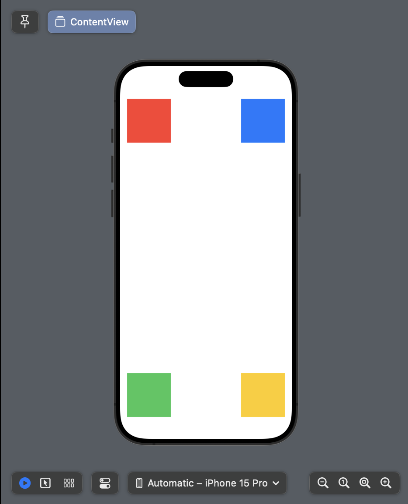
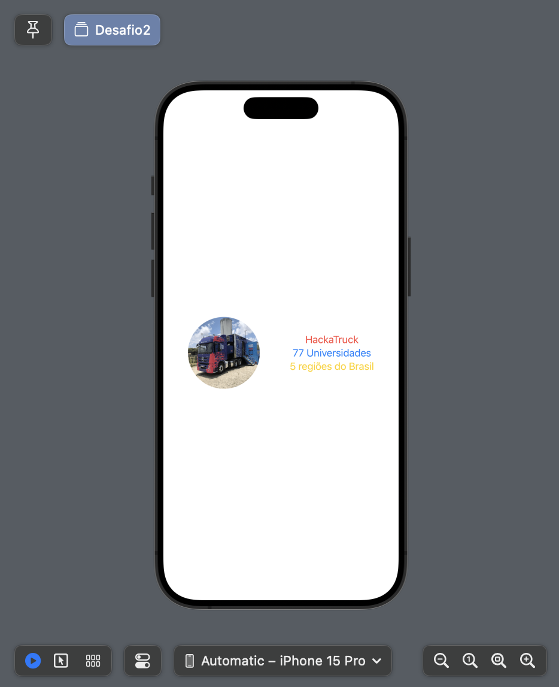
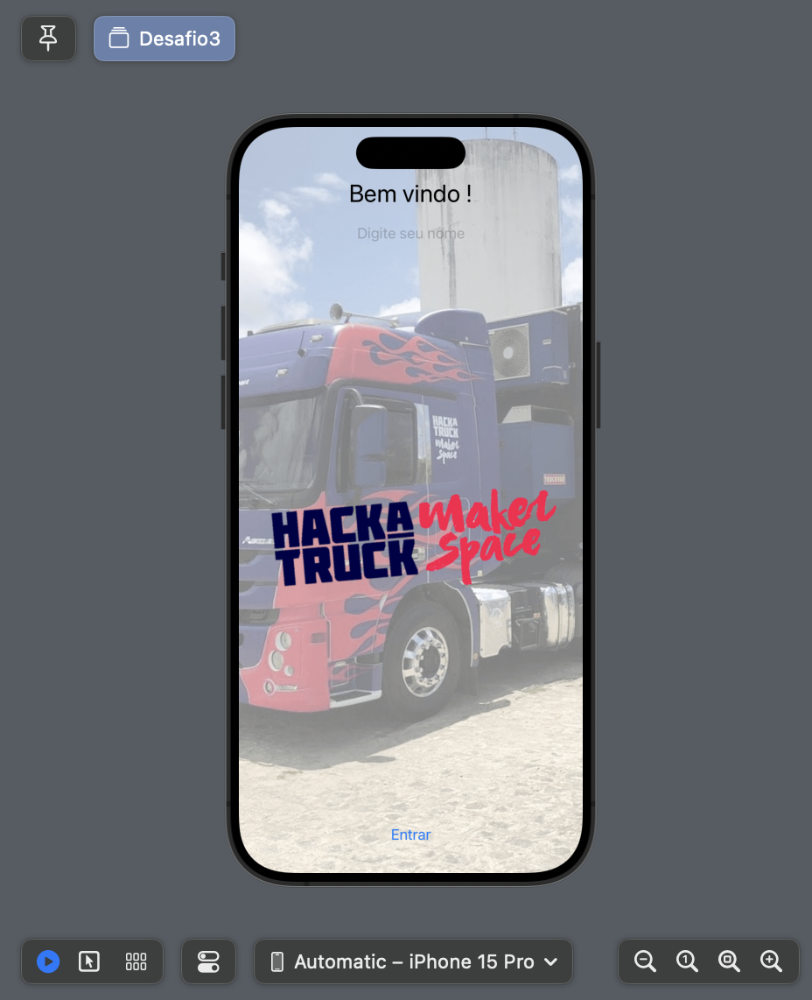

<h2>Desafios 1, 2 e 3</h2>

<table>
  <tr>
    <td align="center">
      <strong>Desafio 1</strong> 
      
    </td>
    <td align="center">
      <strong>Desafio 2</strong> 
      
    </td>
    <td align="center">
      <strong>Desafio 3</strong> 
      
    </td>
   
  </tr>
</table>

## 🧩 Desafio 1

O Desafio 1 foca na criação de uma interface utilizando **formas geométricas coloridas** (retângulos) e no uso adequado das estruturas de layout do **SwiftUI**: `VStack`, `HStack` e `Spacer`.

### ✨ Funcionalidades principais:

- Interface composta por **4 retângulos coloridos**:
  - Vermelho (superior esquerdo)
  - Azul (superior direito)
  - Verde (inferior esquerdo)
  - Amarelo (inferior direito)
- Layout com duas `HStacks` (uma no topo, uma embaixo), organizadas verticalmente por uma `VStack`.
- Uso de `Spacer()` para criar **espaçamento automático e responsivo** entre os elementos.

## 🧩 Desafio 2

Este desafio apresenta uma interface que combina imagem e texto de forma organizada usando o `HStack` e `VStack` do SwiftUI.

### ✨ Funcionalidades:
- Uma imagem circular do caminhão (`truck`).
- Um grupo de três textos dispostos verticalmente com cores distintas:
  - **"HackaTruck"** em vermelho.
  - **"77 Universidades"** em azul.
  - **"5 regiões do Brasil"** em amarelo.

## 🧩 Desafio 3

O Desafio 3 propõe a criação de uma interface interativa com entrada de dados e exibição personalizada utilizando SwiftUI.

### ✨ Funcionalidades principais:

- **Imagem de fundo** com opacidade reduzida, ocupando toda a tela.
- **Mensagem de boas-vindas** personalizada com o nome digitado pelo usuário.
- **Campo de texto (`TextField`)** para digitar o nome.
- **Imagem do logo HackaTruck** redimensionada.
- **Botão "Entrar"** que exibe um **alerta** com o nome informado.

### 🧠 Conceitos aplicados:

- `@State` para armazenar e monitorar o nome e o estado do alerta.
- `ZStack` para sobrepor elementos sobre a imagem de fundo.
- `Spacer()` para espaçamento flexível entre os componentes.
- Uso de modificadores como `.resizable()`, `.scaledToFill()`, `.opacity()` e `.alert`.
